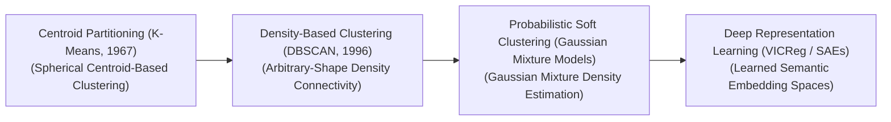
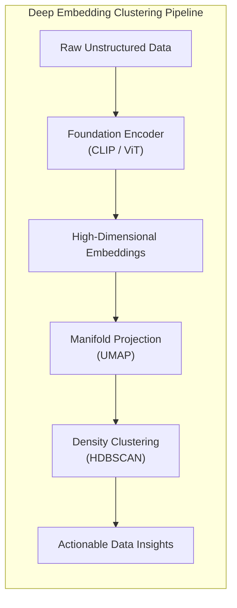

# Awesome-Clustering-Algorithms
## Clustering Algorithms in AI: History, Progression, Variants, & Applications

Clustering is a foundational unsupervised machine learning paradigm designed to partition an unlabelled dataset into distinct groups (clusters) based on intrinsic feature similarities and geometric densities [INDEX: 4]. Unlike supervised classification models that rely on human-annotated target labels, clustering algorithms explore raw multidimensional spaces independently to minimize intra-cluster distance (keeping items within a group close together) while maximizing inter-cluster distance (separating groups from each other) [INDEX: 4]. 

Over the history of artificial intelligence, clustering has evolved from rigid, distance-based parametric partitioning to density-based tracking, probabilistic mixture networks, and modern deep-representation latent space groupings [INDEX: 4].

---

## 1. The Macro Chronological Evolution

The technical framework governing automated data grouping has transitioned from rigid centroid partitioning to hierarchical trees, density-based boundary tracking, and modern self-supervised deep embedding spaces.

*   **The Centroid & Hard Partitioning Era (K-Means Baseline, ~1960s–1980s)**
    *   *Concept:* The early mathematical baseline [INDEX: 4]. Algorithms like **$K$-means (1967)** partitioned data into a pre-defined number ($K$) of spherical clusters by iteratively calculating geometric averages (centroids) and assigning data points to their nearest center using Euclidean distance metrics [INDEX: 4].
    *   *Limitation:* Rigid geometric constraints [INDEX: 4]. $K$-means assumes clusters are isotropic (spherical) and of roughly equal size, causing it to fail when encountering non-convex shapes, complex elongated contours, or variable densities.
*   **The Hierarchical & Spatial Density Era (DBSCAN / HDBSCAN, ~1990s–2010s)**
    *   *Concept:* Eliminated the requirement to guess cluster counts upfront [INDEX: 4]. Frameworks like **DBSCAN (1996)** redefined clustering through spatial density connectivity. By evaluating neighborhood point counts within a fixed radius ($\epsilon$), it independently tracks arbitrary, curved topological boundaries while filtering out unstructured background noise natively. This was modernized into **HDBSCAN**, which uses hierarchical linkage trees to extract clusters across varying density thresholds.
*   **The Probabilistic Soft-Assignment Era (Gaussian Mixture Models)**
    *   *Concept:* Addressed the limitations of "hard clustering" (where a point belongs strictly to one group). **Gaussian Mixture Models (GMM)** treat data grouping as a statistical density estimation task. By using the **Expectation-Maximization (EM)** algorithm, it fits multiple multi-dimensional Gaussian distributions to the data, assigning each point a continuous probability vector indicating its likelihood of belonging to each cluster.
*   **The Deep Latent Manifold & Representation Era (~2020–Present)**
    *   *Concept:* The current modern state-of-the-art production baseline engineered to cluster high-dimensional, unstructured data (such as web-scale images, text, and source code) [INDEX: 4]. It couples clustering with deep self-supervised networks [INDEX: 4].
    *   *Significance:* Raw data passes through a foundation encoder (like CLIP or a Transformer backbone) to compress attributes into dense, low-dimensional continuous vector embeddings [INDEX: 4]. Advanced algorithms project these arrays into highly structured manifolds (via UMAP or VICReg) before grouping, or utilize overcomplete **Sparse Autoencoders (SAEs)** to cluster abstract human concepts directly within model hidden layers.

---

## 2. Core Functional & Algorithmic Variants

Clustering frameworks are strictly categorized based on the underlying mathematical strategies they use to construct group partitions across a metric space.

- ### A. Partitioning Methods (Centroid-Based)
	*   **Mechanism:** Interleaves assignment and center-calculation steps recursively [INDEX: 4]. $K$-Means++ optimizes initialization by spacing out seed centroids mathematically before running standard distance minimization loops.
	*   **Cons:** Struggles with overlapping or highly non-spherical data boundaries [INDEX: 4].

- ### B. Density-Based Methods (Spatial Connectivity)
	*   **Mechanism:** Scans data spaces based on core, border, and noise point definitions. DBSCAN connects adjacent high-density clusters, while filtering out low-density points as absolute system outliers.
	*   **Pros:** Exceptionally robust at identifying highly complex, irregular geometric shapes (such as interlocking rings or crescent arcs).

- ### C. Distribution-Based Methods (Probabilistic Soft Clustering)
	*   **Mechanism:** Models the global dataset as a mixture of distinct, overlapping statistical distributions (e.g., Gaussian Mixture Models).
	*   **Pros:** Captures multi-faceted cluster boundaries and overlapping data fields accurately, providing clear confidence metrics per data point.

- ### D. Hierarchical Clustering (Linkage Trees)
	*   **Mechanism:** Builds a nested tree structure (a **Dendrogram**). 
	    1.  *Agglomerative:* Bottom-up approach where every point starts as its own cluster, and adjacent pairs merge sequentially based on linkage criteria (Ward's, single, average).
	    2.  *Divisive:* Top-down approach where the entire dataset is split recursively.

---

## 3. The Latent Space Projection & Clustering Matrix

To parse and cluster high-dimensional arrays cleanly without hitting computational walls, modern enterprise pipelines project features onto low-dimensional manifolds.

*   **Manifold Learning Alignment Layers**
    *   *Profile:* Slashes the Curse of Dimensionality. High-dimensional vector spaces (e.g., a 1536-dimension text embedding) are notoriously difficult to cluster because Euclidean distances become equidistant in extreme dimensions. Manifold layers (t-SNE/UMAP) preserve local and global geometric topologies while compressing arrays down to dense 2D/3D spaces where distance math remains highly descriptive.
*   **Variance-Covariance Regularization (VICReg Blocks)**
    *   *Profile:* Prevents representation collapse [INDEX: 4]. Forces the deep encoder to distribute its features evenly across latent channels during unsupervised pre-training, ensuring downstream clustering algorithms receive highly distinctive, un-correlated parameters.

---

## 4. Production Engineering Challenges & Hardware Solutions

Deploying large-scale clustering runs across massive enterprise database nodes introduces intense memory bus bottlenecks and time complexity penalties.

*   **The Quadratic Distance Calculation and Memory Wall**
    *   *The Problem:* Classical clustering algorithms require computing a massive, global **pairwise distance matrix** across all data points ($O(N^2)$ space complexity). For databases holding tens of millions of records, this creates a catastrophic memory explosion that saturates server RAM and crashes computing clusters.
    *   *Mitigation:* Implementing **Approximate Nearest Neighbors (ANN) vector indexing** (such as HNSW or Inverted File Indexing - IVF), quantizing continuous vectors down into discrete sub-vectors to execute billions of distance checks inside GPU SRAM registers instantly.
*   **The Outlier Noise and Boundary Distortion Stagnation**
    *   *The Problem:* Real-world commercial data streams contain massive amounts of noisy, un-correlated rows. If forced into rigid partitioning frameworks like $K$-means, these outliers pull centroids away from their true geometric centers, distorting the classification accuracy of valid clusters.
    *   *Mitigation:* Shifting infrastructure pipelines toward **Density-Based or Medoid-Based algorithms (PAM / DBSCAN)**, which treat outliers as explicit un-clustered system noise, protecting core centroid positions perfectly.

---

## 5. Frontier Real-World AI Applications

*   **Enterprise Cyber-Security & Fraud Network Anomaly Tracking**
    *   *Application:* Screens millions of high-frequency banking logs and system transaction inputs continuously. Unsupervised density-based clustering and deep autoencoding layers model standard customer interaction fields; the system instantly flags and isolates money laundering or cyber-attacks if an execution vector maps to an un-indexed, low-density outlier cluster.
*   **Open-Vocabulary E-Commerce Product Catalog Ingestion**
    *   *Application:* Processes millions of incoming multi-modal merchant inventory listings daily. Rather than writing manual text categorization rules, listing graphics and descriptions pass through CLIP image-text encoders. Manifold clustering algorithms group the resulting vectors automatically, sorting products into semantically coherent, dynamic taxonomy branches on-the-fly.
*   **Industrial Bio-Informatics & Genomic Sequencing Discoveries**
    *   *Application:* Maps unannotated DNA, RNA, or protein peptide chains spanning billions of data elements. Unsupervised hierarchical linkage trees and distribution mixture models group complex biological sequences by geometric structure, accelerating target-specific de novo drug discovery and tracking viral mutations with high precision.

---

## References
1. MacQueen, J. (1967). Some methods for classification and analysis of multivariate observations. *Proceedings of the Fifth Berkeley Symposium on Mathematical Statistics and Probability*, 1, 281-297 [INDEX: 4].
2. Ester, M., et al. (1996). A density-based algorithm for discovering clusters in large spatial databases with noise. *Proceedings of the Second International Conference on Knowledge Discovery and Data Mining (KDD)*, 226-231.
3. Reynolds, D. A. (2009). Gaussian mixture models. *Encyclopedia of Biometrics*, 741-744.
4. McInnes, L., Healy, J., & Astels, S. (2017). hdbscan: Hierarchical density-based clustering. *Journal of Open Source Software*, 2(11), 205.
5. Radford, A., et al. (2021). Learning transferable visual models from natural language supervision. *International Conference on Machine Learning (ICML)*.
6. Bardes, J., Ponce, J., & LeCun, Y. (2022). VICReg: Variance-covariance-invariance regularization for self-supervised representation learning. *International Conference on Learning Representations (ICLR)* [INDEX: 4].

---

To advance this documentation repository, unsupervised pipeline workspace, or MLOps architecture, consider exploring these adjacent development pathways:
* Build a **Python code snippet using Scikit-Learn** illustrating how to load a high-dimensional text embedding dataset, project the coordinates using UMAP, and execute an automated HDBSCAN clustering pass.
* Generate a **comprehensive Markdown table** explicitly comparing $K$-Means++, Hierarchical Agglomerative Linkage, DBSCAN, Gaussian Mixture Models (GMM), and Deep Embedding Manifold Clustering across mathematical time complexities, requirement for explicit upfront cluster count inputs, resistance to background data noise, and suitability for highly non-convex boundaries.
* Establish a **performance profiling harness using Triton** to track the exact computational throughput and memory bus latency metrics achieved when compiling a fused vector-quantized distance checking block straight into GPU memory registers.

***

**Follow-Up Options Matrix:**

Before updating this documentation layout, let me know how you would like to proceed by choosing one of the options below:
* I can provide a **complete Python code boilerplate using PyTorch** demonstrating how to write a manual $K$-means centroid update loop from scratch.
* I can generate a **Markdown matrix table** tracking the explicit hyperparameter bounds, distance metrics, and scaling constraints utilized by leading industrial platforms to cluster massive production log data.
* I can write a detailed technical explanation focusing on the **mathematics of the Expectation-Maximization (EM) algorithm** and how log-likelihood scaling governs convergence.
1 siteClustering — Beyonds KMeans+PCA…. Perhaps the most popular way of… | by Shahar Gino | Medium14 Jul 2023 — Common shallow-learning algorithms are K-Means, Hierarchical Clustering, Expectation-Maximization (EM) and Density-Based Spatial C...Medium

