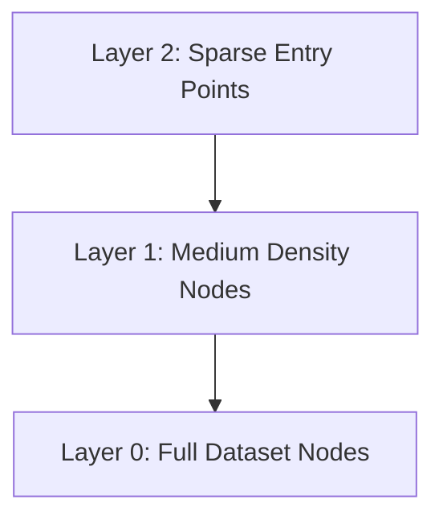

# The Quadratic Distance Calculation and Memory Wall

Computing global pairwise distances scales quadratically ($O(N^2)$), causing memory saturation. Approximate Nearest Neighbors (ANN) indexing like HNSW structures vector data hierarchically to scale searches logarithmically ($O(\log N)$).

## Graph Layer Hierarchy

