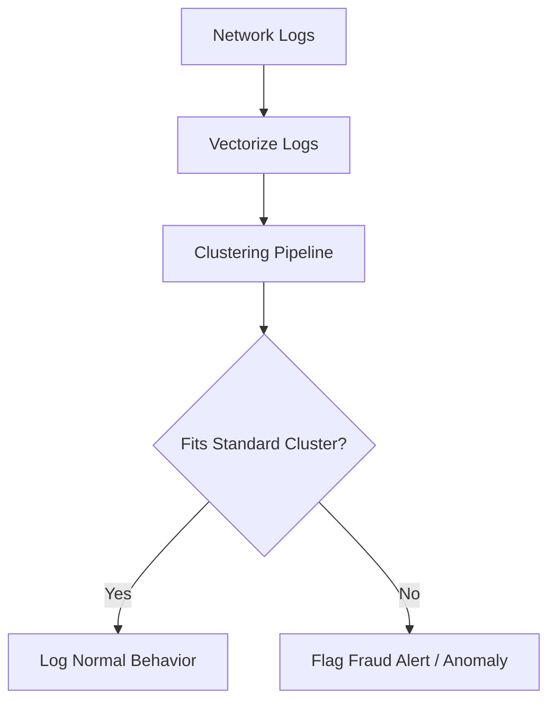

# Enterprise Cyber-Security & Fraud Network Anomaly Tracking

Clustering high-frequency network streams groups standard transaction profiles, allowing real-time identification of malicious intrusion anomalies outside dense clusters.

## Detection Pipeline

