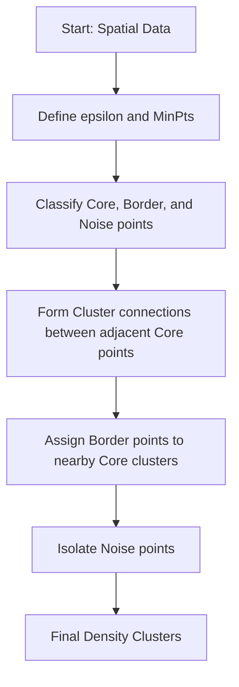

# Hierarchical & Spatial Density Era (DBSCAN / HDBSCAN)

Density-based clustering operates under the premise that clusters are dense regions of points separated by regions of lower density. This approach resolves the limitations of centroid partitioning by identifying arbitrary shapes and detecting background noise.

## Key Definitions
- **Core Point**: A point with at least `MinPts` in its $\epsilon$-neighborhood.
- **Border Point**: A point within the $\epsilon$-neighborhood of a core point but with fewer than `MinPts` neighbors.
- **Noise**: Any point that is neither a core point nor a border point.

## Process Flow Diagram

