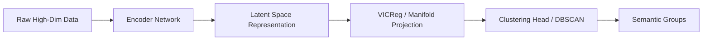

# Deep Latent Manifold & Representation Era

Modern clustering of high-dimensional, unstructured data leverages deep neural networks to project features into a low-dimensional semantic embedding space before applying clustering algorithms.

## Pipeline Architecture

