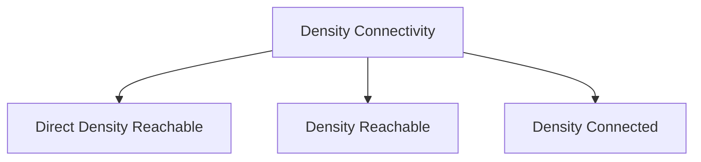

# Density-Based Methods (Spatial Connectivity)

Density-based clustering discovers clusters based on density criteria (minimum density and connection distance), ignoring spatial shapes and treating sparse outliers as noise.

## Core Topology

