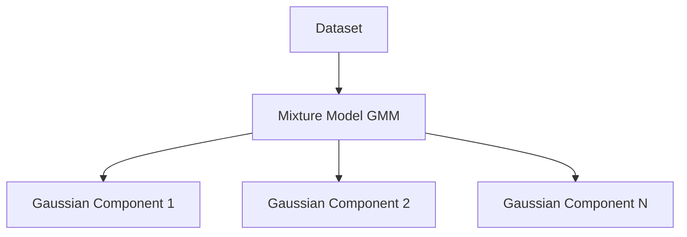

# Distribution-Based Methods (Probabilistic Soft Clustering)

Distribution-based methods assume that the data points in a cluster are generated by a specific probability distribution, modeling clusters as mathematical components.

## Topology

