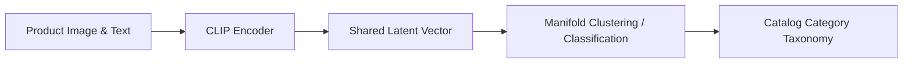

# Open-Vocabulary E-Commerce Product Catalog Ingestion

CLIP image-text representations mapped to shared vector spaces allow dynamic semantic sorting of unstructured merchant products into e-commerce hierarchies.

## Pipeline

