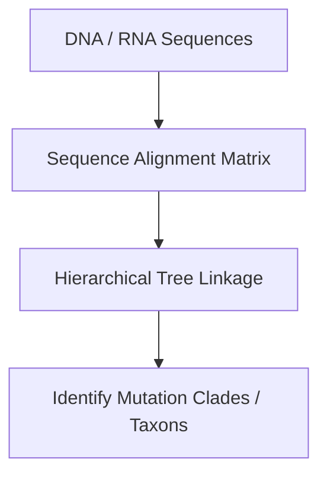

# Industrial Bio-Informatics & Genomic Sequencing Discoveries

Unsupervised hierarchical clustering organizes genetic sequences by evolutionary similarities, assisting in tracing viral mutations and target-specific de novo drug discovery.

## Workflow

