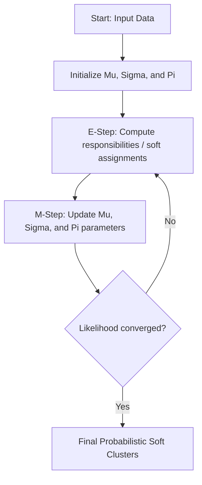

# Probabilistic Soft-Assignment Era (Gaussian Mixture Models)

Gaussian Mixture Models (GMM) represent a probabilistic approach to clustering, assuming that all data points are generated from a mixture of a finite number of Gaussian distributions with unknown parameters.

## Mathematical Formulation
The probability density function is represented as:

$$p(x) = \sum_{k=1}^{K} \pi_k \mathcal{N}(x | \mu_k, \Sigma_k)$$

where $\pi_k$ is the mixing coefficient, and $\mathcal{N}(x | \mu_k, \Sigma_k)$ is the Gaussian distribution for component $k$.

## Process Flow Diagram

