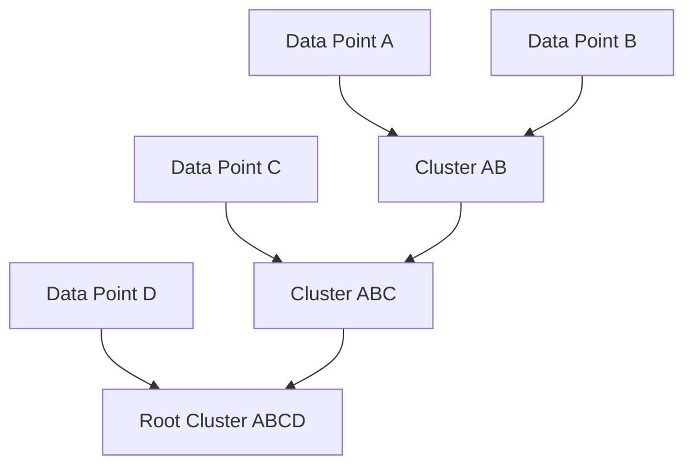

# Hierarchical Clustering (Linkage Trees)

Hierarchical clustering constructs a tree of clusters called a dendrogram. It can be built bottom-up (agglomerative) or top-down (divisive).

## Dendrogram Merge Process

