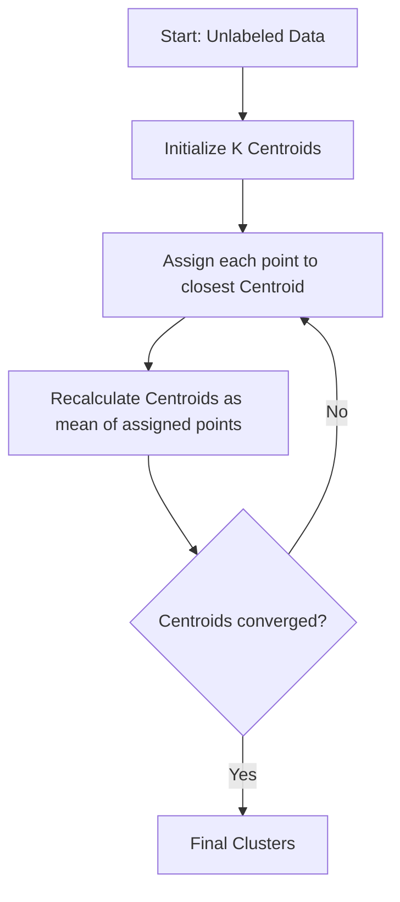

# Centroid & Hard Partitioning Era (K-Means)

Centroid-based clustering represents the earliest mathematical baseline for grouping unlabeled multidimensional data. The primary algorithm in this category is K-Means, introduced by MacQueen in 1967.

## Mathematical Formulation
The objective function of K-Means is to minimize the within-cluster sum of squares (WCSS):

$$J = \sum_{i=1}^{K} \sum_{x \in S_i} \| x - \mu_i \|^2$$

where $S_i$ is the $i$-th cluster and $\mu_i$ is the centroid of $S_i$.

## Process Flow Diagram

## Limitations
1. Assumes isotropic (spherical) clusters of equal variance.
2. Highly sensitive to initial centroid selection.
3. Requires predefining the number of clusters $K$.
