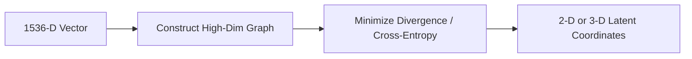

# Manifold Learning Alignment Layers

Manifold learning methods like t-SNE and UMAP reduce dimensionality by mapping high-dimensional spaces to lower-dimensional manifolds while preserving local or global topological relationships.

## Dimensionality Reduction Pipeline

