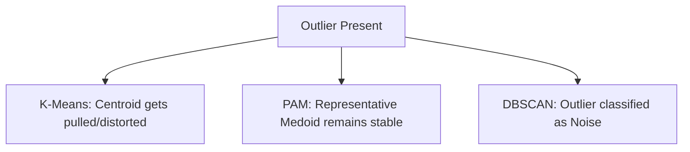

# The Outlier Noise and Boundary Distortion Stagnation

Outliers skew distance-based centroids in algorithms like K-Means. Partitioning Around Medoids (PAM) and DBSCAN handle noise explicitly to protect geometric cluster validity.

## Comparison

