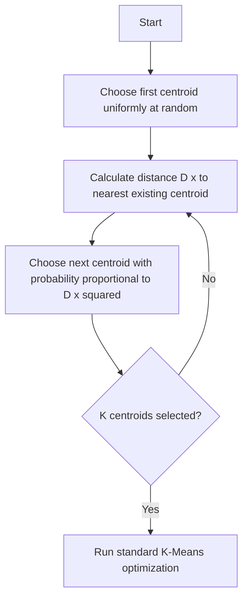

# Partitioning Methods (Centroid-Based)

Centroid-based partitioning algorithms recursively partition the dataset into $K$ distinct groups. A notable advancement is $K$-Means++, which optimizes the initial centroid placement to prevent suboptimal local minima.

## Algorithmic Workflow

