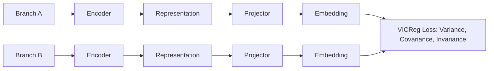

# Variance-Covariance Regularization (VICReg Blocks)

VICReg enforces representation learning variance, covariance, and invariance constraints directly inside the self-supervised latent space to prevent collapse.

## Architecture

